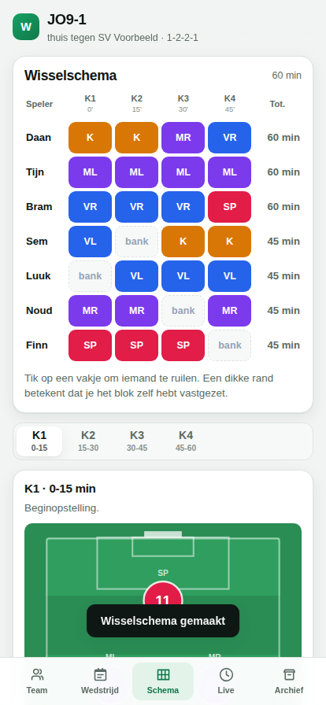
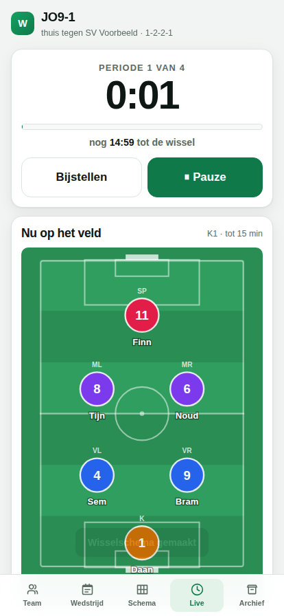
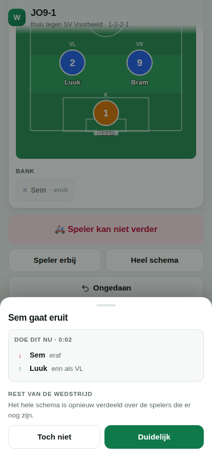
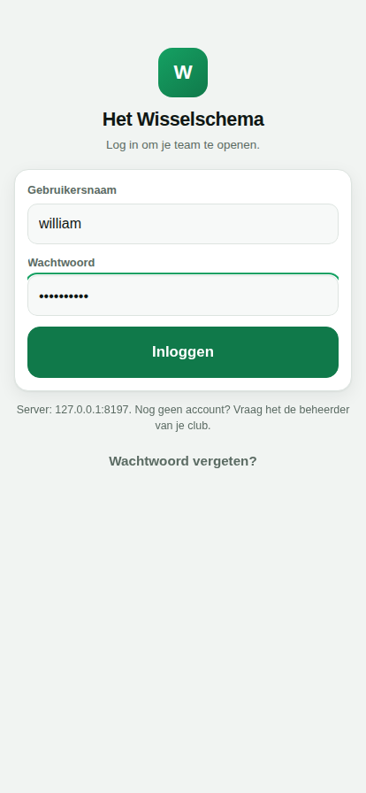
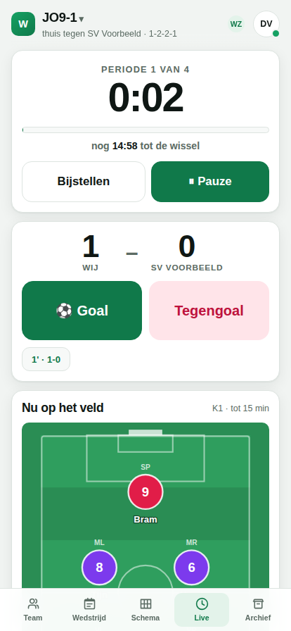
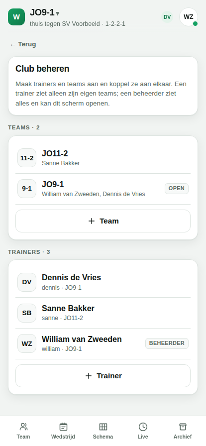

# Het Wisselschema

Een wisselschema-assistent voor jeugdvoetbal. Je zet je team klaar, vinkt aan
wie er vandaag zijn, en de app maakt een schema waarin iedereen ongeveer even
lang speelt. Tijdens de wedstrijd loopt er een klok mee die zegt wanneer je
moet wisselen, en wie erin en eruit gaat.

En als een speler halverwege niet meer kan — geblesseerd, of gewoon op — dan
herberekent de app het schema vanaf dat moment, met behoud van alles wat al
gespeeld is.

**Alles zit in één bestand.** Open `index.html` en het werkt. Geen installatie,
geen account, geen internet nodig.

**En samen kan ook.** Zet hetzelfde bestand op een kleine server (de Home
Assistant-add-on) en je werkt met je medetrainer tegelijk aan één team: de een
houdt de klok en de wissels bij, de ander de score. Met accounts en teams deel
je hem met de hele club.

<p align="center">
  
  
  
</p>

## Wat het doet

- **Team beheren** — namen plakken uit een appje, of een lijst uploaden. Per
  speler: rugnummer, of hij kan keepen, en voorkeursposities.
- **Wedstrijd klaarzetten** — wie is er vandaag, welke speelvorm (4-, 6-, 7-,
  8- of 11-tal), hoeveel perioden van hoeveel minuten, en welke opstelling.
- **Schema maken** — zo eerlijk mogelijk verdeeld, met een echte keeper in elk
  blok, keepersbeurten verdeeld, en niemand twee blokken achter elkaar op de bank.
- **Zelf bijsturen** — tik op een vakje om twee spelers te ruilen. Dat blok
  ligt dan vast en de rest wordt eromheen opnieuw verdeeld.
- **Live meelopen** — klok per periode, aftelling tot de volgende wissel,
  geluid en trilsignaal, en het scherm blijft aan.
- **Onverwachte wissel** — één knop, kies de speler, en je krijgt meteen te
  horen wie erin komt en wie doorschuift. De rest van de wedstrijd wordt
  opnieuw verdeeld over wie er nog staat.
- **Score bijhouden** — twee grote knoppen in het live-scherm: goal of
  tegengoal. Bij elk doelpunt onthoudt de app wie er op het veld stond. In het
  archief zie je per speler de doelpunten voor en tegen terwijl hij speelde
  (plus-min), zodat je ziet met welke opstelling het loopt.
- **Seizoenssaldo** — na afloop wordt bijgehouden wie voor- of achterloopt op
  de gemiddelde speeltijd. Bij het volgende schema krijgt wie achterloopt
  voorrang.
- **Delen** — het hele schema past in een link. De ontvanger heeft geen app en
  geen server nodig. Of kopieer het als platte tekst voor de groepsapp.
- **Samenwerken** — log in op de server van je club en werk met twee (of meer)
  telefoons aan hetzelfde team. Een goal, een wissel of de klok staat binnen
  een tel bij iedereen. Rechtsboven zie je wie er meekijkt, en een stip die
  zegt of alles verstuurd is. Geen bereik? Gewoon doorwerken: zodra er weer
  verbinding is, wordt alles samengevoegd.
- **De club** — de beheerder maakt trainers en teams aan en koppelt ze aan
  elkaar. Iedere trainer ziet alleen zijn eigen teams. Voor een nieuwe trainer
  maakt de app een berichtje met adres, gebruikersnaam en wachtwoord, klaar om
  door te sturen.

## Aan de slag

```bash
git clone https://github.com/williamvz/het-wisselschema
cd het-wisselschema
open index.html          # of dubbelklik erop
```

In de app: **Team → Voorbeeldteam** om meteen te kunnen spelen.

Op je telefoon: open het bestand en kies "Zet op beginscherm". Daarna start
hij als een gewone app, ook zonder bereik.

## Op Home Assistant

Zie [`deploy/homeassistant/README.md`](deploy/homeassistant/README.md). Kort:

1. **Los bestand** — `index.html` in `/config/www/` en een `panel_iframe` in
   je configuratie. Vijf minuten werk, geen accounts, geen samenwerken.
2. **Als add-on** — kopieer `deploy/homeassistant/addon` naar `/addons/`. De
   app verschijnt in de zijbalk van Home Assistant, met accounts en teams. De
   eerste keer maak je in de app de beheerder aan, met een code uit het
   logboek van de add-on. Stond er al een team op de server, dan wordt dat je
   eerste team.

Om hem met de club te delen, zet je er een eigen domein voor. Er staat een
recept voor Cloudflare Tunnel en voor Nginx Proxy Manager bij, inclusief wat
je daarbij over beveiliging moet weten.

## Hoe het schema tot stand komt

Het probleem wordt in twee lagen opgelost. Dat maakt het niet alleen
oplosbaar, maar vooral uitlegbaar aan de ouder die vraagt waarom zijn kind
maar drie kwart speelde.

**Laag 1 — wie speelt er?** Speeltijd is een verdelingsvraag over de hele
wedstrijd. Elke speler krijgt een doelaantal minuten, evenredig aan hoe lang
hij beschikbaar is. Een greedy startoplossing plus local search minimaliseert
de kwadratische afwijking van dat doel, met strafpunten voor twee blokken
bankzitten op rij en voor een blok zonder keeper. Meerdere herstarts, beste
uitkomst wint.

**Laag 2 — waar staat iedereen?** Positie is een vraag per blok, en een exact
oplosbaar toewijzingsprobleem: het
[Hongaars algoritme](src/lib/hungarian.js) over een kostenmatrix van speler
tegen positie. Kosten voor een positie buiten je voorkeur, korting voor
blijven staan waar je stond. Die korting is bewust zwaar: bij een uitval
verschuiven er gemiddeld **0,6** spelers van positie, niet het halve elftal.
Langs de lijn wil je "Daan op doel, Finn erin" kunnen roepen.

**Herplannen** werkt doordat een blok op elk moment doormidden geknipt kan
worden. Valt er iemand uit op minuut 23, dan wordt kwart 2 twee deelblokken:
0-23 staat vast als gespeelde historie, 23-30 gaat de nieuwe verdeling in.
Wat al gespeeld is telt gewoon mee in de eerlijkheidsberekening, dus het
schema compenseert vanzelf.

## Hoe samenwerken werkt

<p align="center">
  
  
  
</p>

Langs de lijn is het bereik slecht, dus de app wacht nooit op de server.
Elke telefoon heeft zijn eigen kopie van het team en past een tik meteen toe.
Daarna gaat de wijziging naar de server, die per team een versienummer
bijhoudt. Wie iets stuurt, zegt op welke versie het gebaseerd is. Was iemand
anders je net voor, dan krijg je terug wat er intussen veranderde, voeg je
samen en stuur je opnieuw.

Dat samenvoegen is een [driewegsamenvoeging](src/lib/samenvoegen.js): de
laatste stand die beide telefoons kenden, en wat ieder daarna deed. Twee
goals van twee trainers komen er allebei in, want doelpunten, spelers en het
archief worden per id samengevoegd. Zet de een een speler uit de wedstrijd en
de ander een tweede, dan zijn ze er allebei uit. Alleen waar beide telefoons
hetzelfde veld veranderden, moet er één winnen. Bij de klok en het schema is
dat de laatste wijziging, en niet de telefoon die het eerst weer bereik had:
wie een kwartier offline stond, mag bij terugkomst niet de wissel van zijn
collega terugdraaien. Ook *ongedaan maken* is samenvoegen: het draait jouw
stap terug, en laat de goal staan die je collega daarna invoerde.

De klok rekent met de tijd van de server. Elk antwoord van de server heeft
zijn klok erbij, en de app schat daarmee het verschil met de eigen klok. Zo
lopen twee telefoons gelijk, ook als er een een halve minuut verkeerd staat.
Dat de klok aan het eind van een periode vanzelf stopt, telt daarbij niet als
wijziging van een trainer: een telefoon die offline de oude klok liet
doorlopen, wint daarmee niet van wat een collega intussen echt deed.

Na een herstart van de server halen de telefoons alles één keer opnieuw op en
voegen ze samen met wat ze kenden. Daardoor werkt ook een teruggezette back-up
zoals je verwacht: de back-up geldt, en alleen wat een telefoon nog niet had
verstuurd, komt erbij.

Wijzigingen van de ander komen binnen via één verzoek dat openstaat tot er
iets verandert (long polling). Dat werkt door elke proxy heen, ook door de
ingress van Home Assistant en door een Cloudflare-tunnel. Kapt een proxy
lange verzoeken toch af, dan wacht de app voortaan korter.

## Ontwikkelen

```bash
npm install        # alleen nodig voor de tests
npm run build      # src/ -> index.html (één bestand, geen bundler-afhankelijkheid)
npm test           # 77 tests: motor, samenvoegen, server, en de app in een browser
npm run check      # laadt alle modules, vangt import- en syntaxfouten
npm run serve      # draait de server lokaal op poort 8099 (inrichtcode in de uitvoer)
```

```
src/lib/        de motor, zonder DOM: opstellingen, Hongaars algoritme, planner,
                samenvoegen
src/app/        de schermen, in gewoon DOM zonder framework, en de
                samenwerking met de server (samenwerken.js)
build/build.mjs bundelt alles tot één index.html
test/           motortests, browsertests (Playwright) en servertests
deploy/         Home Assistant: add-on (server.mjs, club.mjs) en handleiding
```

De motor in `src/lib/` kent geen DOM en draait net zo goed in Node. Daar zit
het meeste denkwerk, en daarom het meeste testwerk: eerlijke verdeling,
keepersbeurten, te weinig spelers, late binnenkomers, uitvallers, en een
wissel die twee minuten te laat wordt uitgevoerd.

`index.html` staat in de repository omdat dat het product is — je moet hem
kunnen downloaden en openen zonder iets te installeren. Hij wordt gemaakt door
`npm run build`; pas hem niet met de hand aan.

## Aantekeningen

- Zonder server blijven alle gegevens in je browser (`localStorage`). Er gaat
  niets naar buiten.
- Met een server staan de teams op die server, in gewone JSON-bestanden onder
  `/data`, en gaan ze mee in de back-ups van Home Assistant. Wachtwoorden
  staan er alleen als scrypt-hash, sessies alleen als hash van het token. Na
  tien foute pogingen vanaf één adres (of vijftig in totaal) wacht een
  gebruikersnaam een kwartier. De server heeft geen afhankelijkheden, net als
  de app.
- Gelijke speeltijd is in de KNVB-jeugd tot en met JO12 het uitgangspunt. De
  app is daarop ingesteld. Er is een schuif om accent op basisspelers te
  leggen, met een waarschuwing erbij; hij staat standaard dicht.
- Geen afhankelijkheden in de app zelf. `playwright-core` is er alleen voor
  de tests.

## Licentie

MIT, zie [LICENSE](LICENSE).
